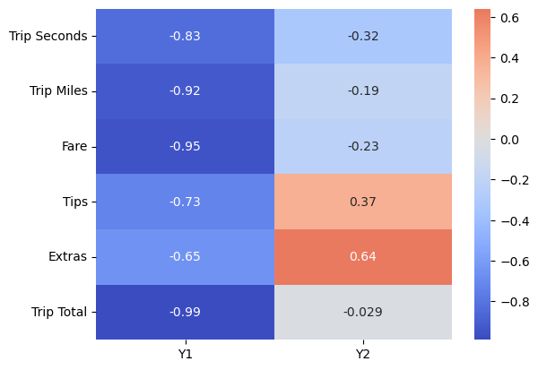
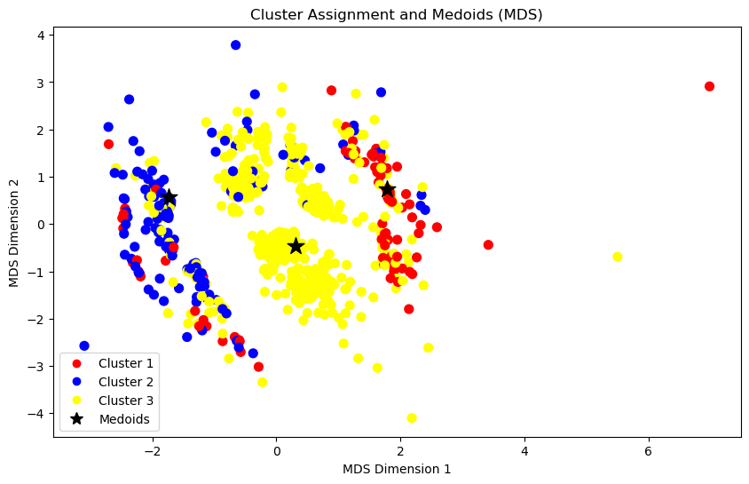

# Taxi rides study
## PCA from scratch and clustering with k-medoids algorithm

In this project, we analyze the publicly available **Taxi Trips (2013-2023)** dataset taken from the [Chicago Data Portal](https://data.cityofchicago.org/). Due to the size of this dataset, we filtered only the trips that occurred during April 2023.

### Analysis conducted

The first part of the project discusses:
- The choice between using covariance or correlation matrices in the PCA method, depending on the nature of the data.
- Different methods for discarding principal components, including a comparison of their effectiveness.
- Practical interpretation of the first two principal components.
- The stability of the PCA results.

For the second part, the following analysis is implemented:
- The choice of the clustering method based on the nature of the data.
- The implementation of Fast-K-medoids algorithm based on the Generalized Gower distance. The distance metrics are chosen according to the type of data.
- The projection of the data into a two-dimensional space with Multidimensional Scaling.
- Interpretation of the clusters obtained.

### Results obtained

From the PCA analysis, we derive two principal components that explain 85% of variability. We suggest that **PC1** describe trip "size" represented by such variables as "Trip Seconds", "Trip Total", "Fare" and "Trip Miles". Unlike PC1, **PC2** distinguishes rides based on additional characteristics such "Tips" and "Extras". These variables generally represent some additional services taken during the ride (for "Extras" it can be baby passenger seat or toll road) and customer's satisfaction (for "Tips"). 

From the cluster analysis implemented through k-medoids method, we obtain 3 clusters.

The rides in the **Cluster 1** primarily occur at night, suggesting minimal traffic and quick trip completions. The use of Mobile payments may imply that the main users are possibly younger riders who are more likely to have an active social life.

The **Cluster 2** is representative of general weekend rides, with no notable extras or tips. The lengthy rides and daytime timing indicate a variety of purposes, such as shopping, errands, or leisure activities. The use of Cash as the primary payment method may point to casual, unplanned trips.

The **Cluster 3** likely represents regular weekday rides taken during work hours, particularly during peak traffic times in the morning and afternoon. The presence of tips and extra charges suggests business-related rides where riders might leave tips as an expression of gratitude or due to company-paid expenses. The daytime occurrence and higher extras could also indicate longer waiting times or toll costs during traffic.

The full version of the code can be found at this [link.](https://github.com/karakumka/portfolio/blob/main/Project1/Taxi_rides_Chicago.ipynb)

