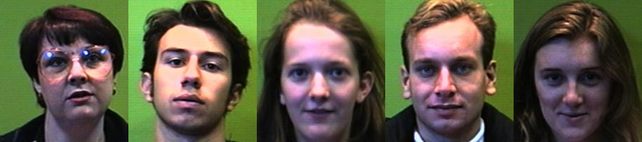
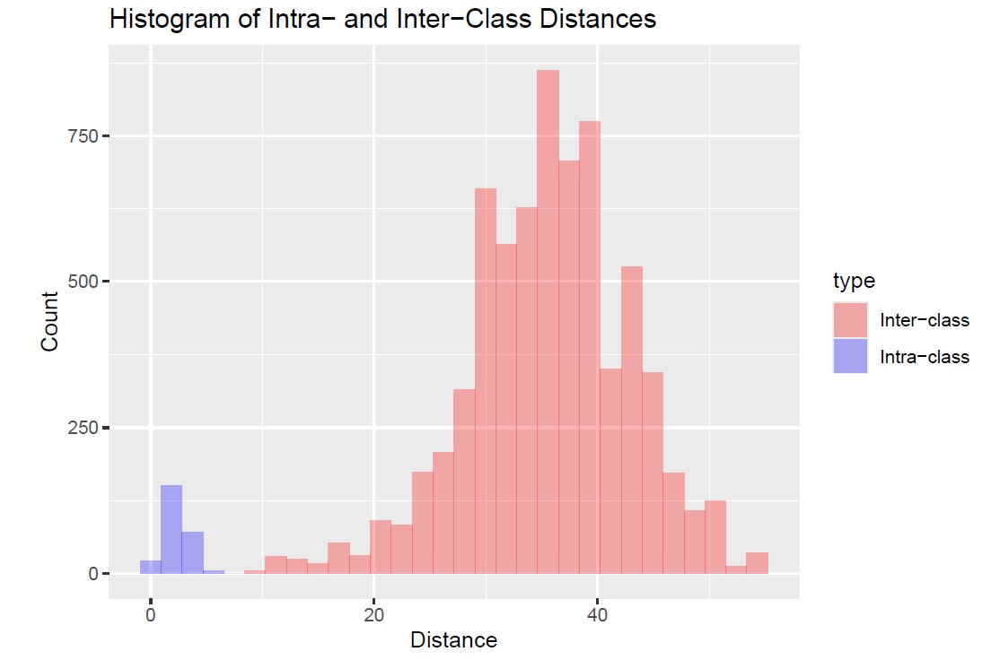

# Face Recognition study
## Implementation of a classifier using PCA, FDA, and CNN

In this project, we use 150 images of 25 different individuals to train a classifier capable of identifying the person in a given image (predicting its class).

### Analysis conducted

#### PCA-FDA Classifier

- Use **Principal Component Analysis (PCA)** to reduce the high-dimensional pixel space of facial images.
- Apply **Fisher Discriminant Analysis (FDA)** to maximize the separation between different classes while minimizing the variation within each class.
- Determine the number of Fisher discriminants such that the maximum intra-class distance and the minimum inter-class distance are as far apart as possible.
- Perform a grid search over hyperparameters (number of neighbors and distance metrics) during cross-validation.
- Build the final classifier by projecting the data into PCA space, then into Fisher space. For each image, we find the `k` nearest neighbors and assign the label based on proximity. If the average distance is below a predefined threshold, the image is classified with the label of the nearest neighbor.

#### CNN Classifier

In the second part, we implement a deep learning-based approach:

- Design and train a **Convolutional Neural Network (CNN)** architecture.
- Use **K-fold cross-validation**: for each split, the model is trained and the validation accuracy is recorded.
- Compare the CNN results to those obtained using the PCA-FDA pipeline.

### Results obtained

To retain 95% of the variance, 29 principal components were selected. The best separation between inter- and intra-class distances was achieved using 18 Fisher discriminants.

Grid search results suggest using **1 nearest neighbor** and the **maximum** distance metric. Using these parameters, the final classifier achieves a **test accuracy of 0.967**, demonstrating strong generalization performance on previously unseen data.

The full version of the code can be found at this [link.](https://github.com/karakumka/portfolio/blob/main/Project3/FDA_github.Rmd)

Next, we explore how a Convolutional Neural Network (CNN) performs in classifying images into 25 categories. The CNN architecture consists of an input layer, three convolutional layers, two max-pooling layers, a flatten layer, and two dense layers.

The **mean cross-validation accuracy across 5 folds is 0.967**, demonstrating strong generalization performance.

The full version of the code can be found at this [link](https://github.com/karakumka/portfolio/blob/main/Project3/CNN_classifier.ipynb).

### Conclusion

Both the CNN and the PCA-FDA-based classifier demonstrate strong performance on the classification task, achieving comparable accuracy under the given conditions.
